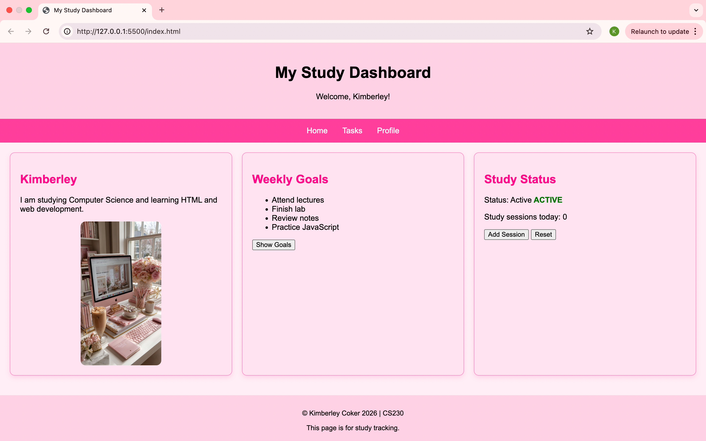

# Study Dashboard

A responsive study dashboard built with HTML, CSS and JavaScript to help students track study goals and monitor progress.

## Features

- Responsive layout for desktop and mobile devices
- Personal profile section
- Weekly study goals tracker
- Study session counter using JavaScript
- Reset functionality for study sessions
- Custom pink-themed user interface

## Technologies Used

- HTML5
- CSS3
- JavaScript
- CSS Flexbox
- Responsive Design
- DOM Manipulation

## Live Demo

[View Live Demo](https://k2005c.github.io/Study-Dashboard/)
## Author

Kimberley Coker